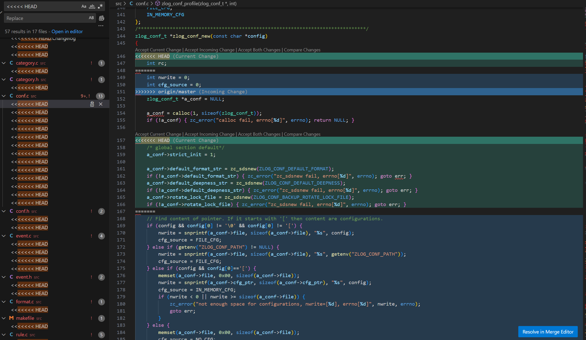

# vscode之一——初见便惊艳

## 抛弃sourceInsight

前两年在工作上负责一个大量代码移植的工作，代码量大概在6-8万行，几个人一起做。

这个代码移植工作，实际上是两个代码分支同时开发，项目A和项目B。每隔一段时间要把A分支的代码改动都合并到B分支。

合并带来的问题是，大量的代码冲突。上千个文件都是冲突，而且有些文件惨不忍睹，一个文件的冲突就有几十处。

大概感受一下，类似这种：



当时看到这种，脑袋都是大的。

当时写代码用的是source insight, 本地代码放在测试机，通过电脑remote连接，有几个让人恼火的点：

- 不停地自动刷新，项目大文件多，导致老卡，使用体验真的很不好；
- 文件巨多，搜索起来花费时间很长，而且经常漏掉；
- 代码编辑体验也不好；

唯一令我留恋的是查看函数调用关系。

解冲突要把这些玩意一点点删掉，费时又繁琐。

```c
<<<<<<< HEAD
=======
>>>>>>> origin/master
```

这让我动了找一找是不是有其他替代工具的念头。

## 初见vscode

当时在公司内网上看到有人用vscode和另外一款软件，我只记得轻量级这个特点让我选择了vscode.

在紧张的工作中，我花了大半个下午解决了安装、网络、远程连接各种问题之后，办公室又热，我都满脸通红了。

坐下来喝了口水，终于可以用上了。

这玩意出场便惊艳了我。

因为我看到了这个。


什么？还可以这样玩！

- Accept Current Change
- Accept Incoming Change
- Accept Both Changes
- Compare Changes

这几个按钮非常赏心悦目，就这样，解冲突的工作变得好愉快啊！

50%的冲突一键搞定！

初见便爱上。

一见钟情！

从此便开始了我的vscode探索之旅!

下回见！
